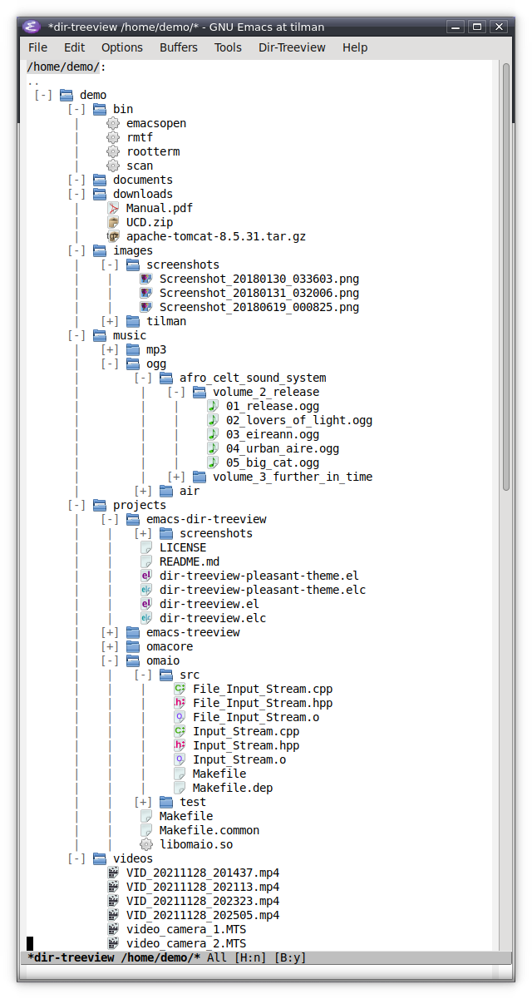
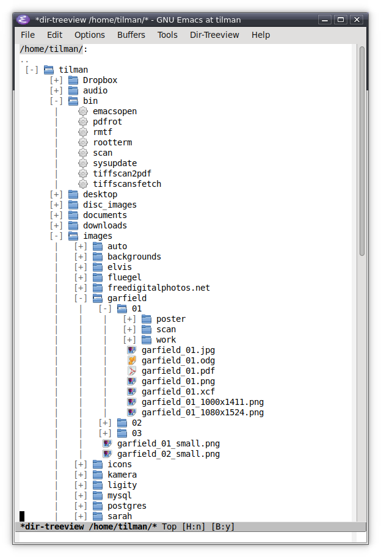
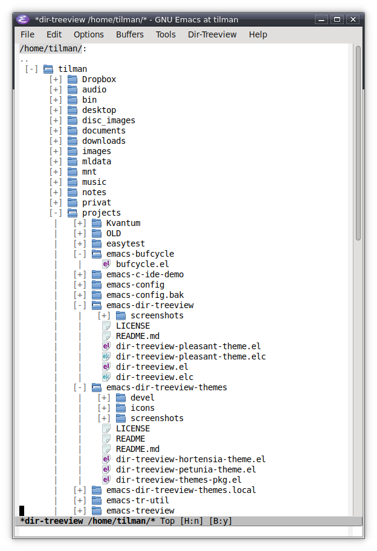
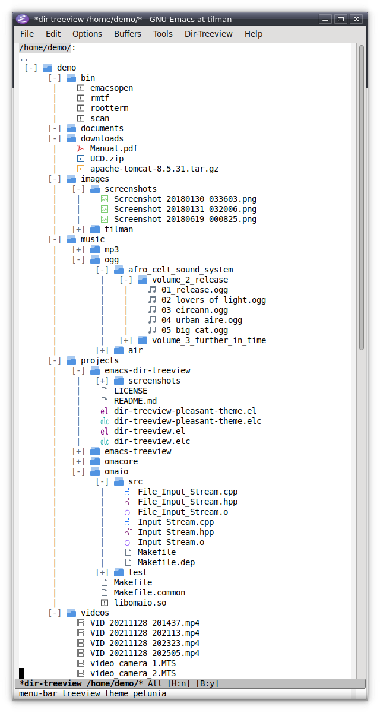
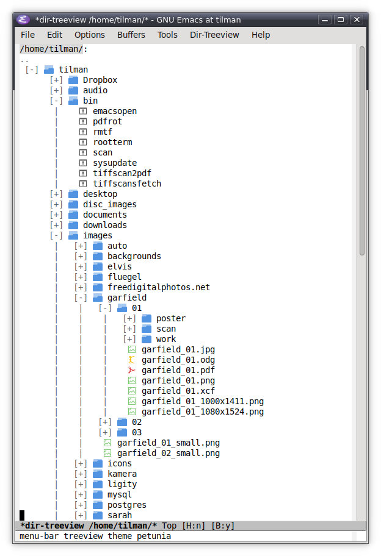
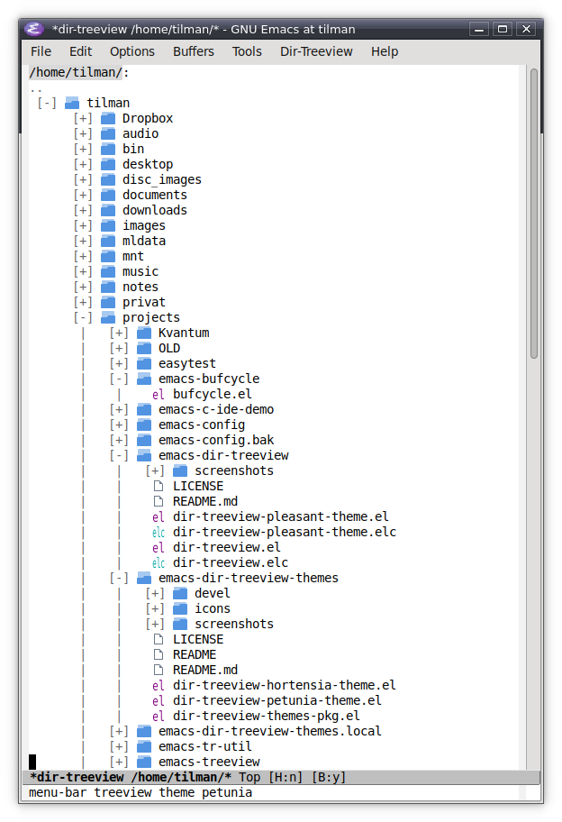

emacs-dir-treeview-themes
=========================

Themes for [emacs-dir-treeview](https://github.com/tilmanrassy/emacs-dir-treeview), a file browser and manager for Emacs.

This document describes version 1.0.3 of emacs-dir-treeview-themes.

* [Overview](#overview)
* [Screenshots](#screenshots)
  * [Theme 'Hortensia'](#theme-hortensia)
  * [Theme 'Petunia'](#theme-petunia)
* [Installation](#installation)


Overview
--------

This project provides two themes for [emacs-dir-treeview](https://github.com/tilmanrassy/emacs-dir-treeview), "Hortensia" and "Petunia".
See the [screenshots](#screenshots) section below for how they look like.

The themes use pixmap icons based on the [Oxygen](https://github.com/KDE/oxygen-icons5),
[Emerald](https://github.com/vinceliuice/emerald-icon-theme), and [Tela](https://github.com/vinceliuice/Tela-icon-theme) icon themes.

The repository also contains utilities to build the themes (see subfolder `devel`). However, it is not necessary to build the themes.
The repository includes them ready-to-use.


Screenshots
-----------

#### Theme 'Hortensia'





#### Theme 'Petunia'






Installation
------------

### From MELPA

Dir-treeview-themes is available on [MELPA](https://melpa.org/). Provided MELPA is configured in your Emacs
(see [here](https://melpa.org/#/getting-started) for more information), you can install dir-treeview-themes by typing:

```
    M-x package-install RET dir-treeview-themes RET
```

### Manual installation

As a prerequisite, install [emacs-dir-treeview](https://github.com/tilmanrassy/emacs-dir-treeview).

Copy the file dir-treeview-themes.el to somewhere in the load path. Optionally, byte-compile the
file.

Copy the files `dir-treeview-themes-hortensia-theme.el` and `dir-treeview-themes-petunia-theme.el` to somewhere in the theme
load path (cf. Lisp variable `custom-theme-load-path`).

Copy the folder `icons` to the same directory as the two theme files, so that `dir-treeview-themes-hortensia-theme.el`,
`dir-treeview-themes-petunia-theme.el`, and `icons` are in the same directory (if the `icons` directory already exits, copy the
two subdirectories `hortensia` and `petunia` of this projet's `icons` directory to the existing target `icons` directory).

You can also copy the `icons` folder to any other location. In that case, add the absolute path of the copied `icons` folder to the
`dir-treeview-icon-dir-list`. The latter is a customizable Lisp variable. You can edit it with

```
    M-x customize-variable RET dir-treeview-icon-dir-list RET
```

For enabling the themes, see section  [Enabling themes](https://github.com/tilmanrassy/emacs-dir-treeview#enabling-themes) in the
documentation of [emacs-dir-treeview](https://github.com/tilmanrassy/emacs-dir-treeview).
